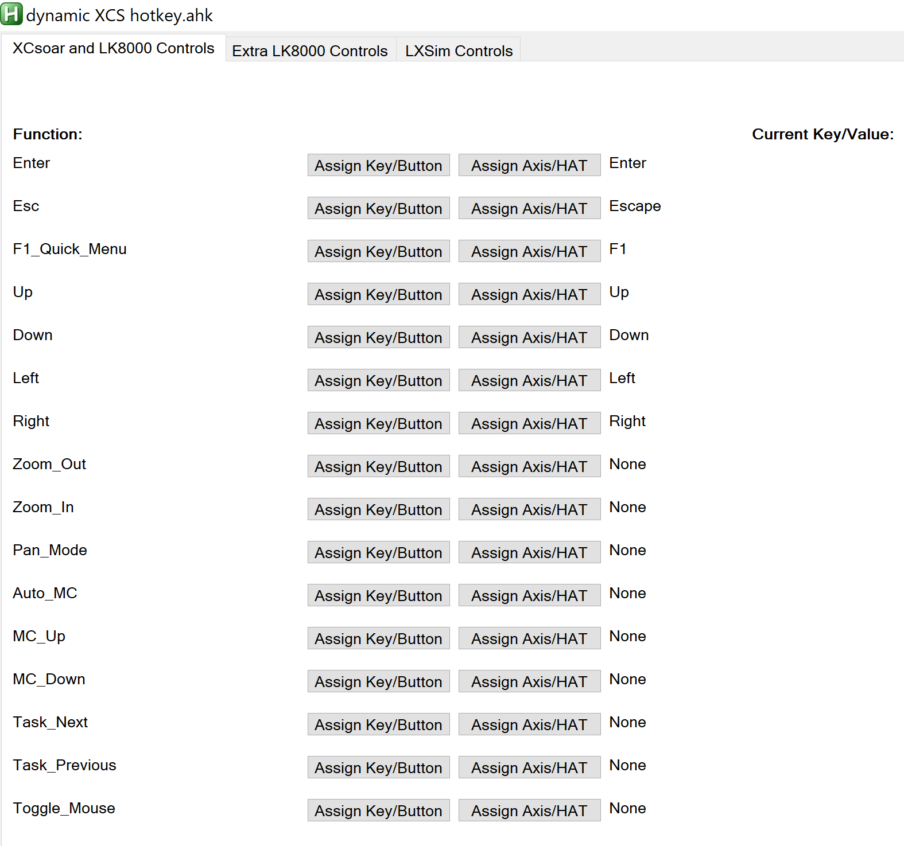

# XCSoar-LK8000-hotkeys
Map joystick controls/buttons, or keys, to control XCSoar or LK8000. Great for VR.

This script controls XCSoar/LK8000 without losing focus on your active app (ie. Condor).

Here are some of the things you can do in XCsoar without leaving Condor or VR:
- Go to the F1 Quick Menu, access menus and adjust settings (eg: add ballast in "Flight Setup")
- Go to Pan Mode, look around the map and zoom in/out to plan out your route
- Go to next or prev waypoint
- Change MC setting

To use this:
1. Download the AHK script (requires you have AutoHotKey 1.1 installed) or the .exe file (does not require AHK) from releases: https://github.com/ryanwoodie/XCSoar-LK8000-hotkeys/releases (if you use the .exe you will get warnings from your browser and computer about it. It is safe to use.)
2. Copy the custom_keys.xci file to your XCSoar directory. In XCSoar go to config > system > language/input > events and choose this xci file.
3. Run the AutoHotKey script and mop keys/buttons or joystick axes, d-pad or HAT/POV to the various XCsoar or LK8000 commands.

There are extra_1 to extra_4 hotkeys if you want to add more commands into your XCI file (assign these to F21 to F24 keys in your XCI file)
